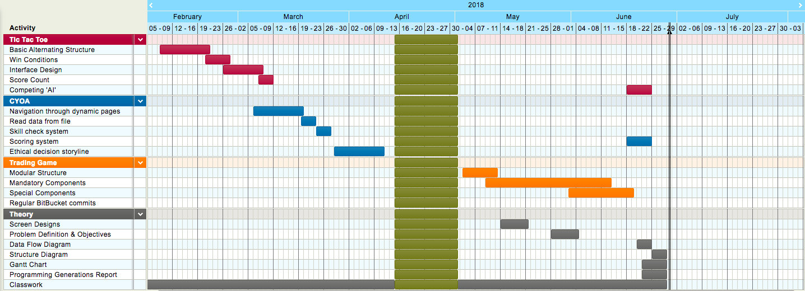
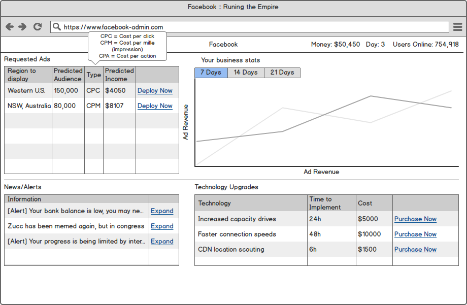
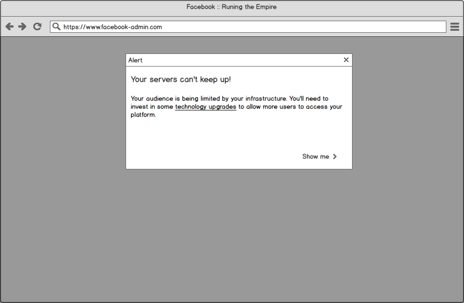
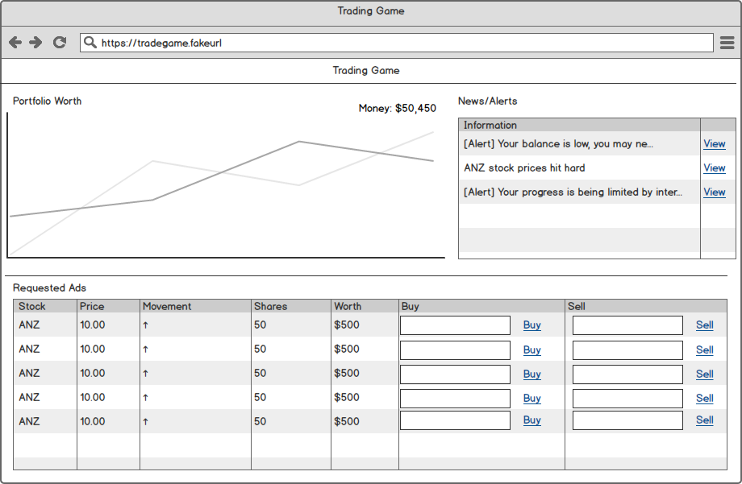
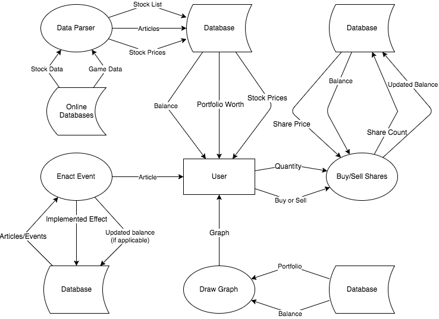
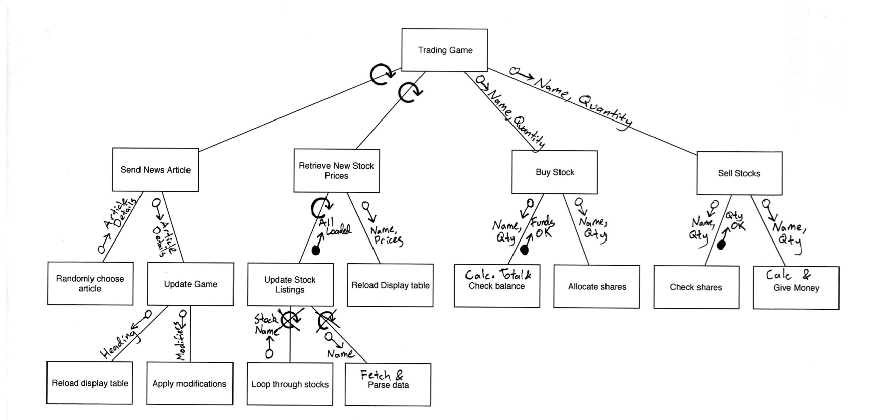

# Defining the Problem

### Problem Definition

My Trading Game is a consumer-faced stock market emulator, allowing users/players to simulate what trading in a real stock market would be like. The only real objective of the game is to build your portfolio worth by observing market trends and exploiting the nature of a changing stock price.

This game is targeted at anyone who would like to gain experience in stock market trading risk-free, and to see how certain decisions may affect their portfolio. 

To increase the legitimacy of my simulation, the game uses live data gathered from an API every minute. This allows the user if they desire to improve their portfolio and progress by reading other data sources such as financial news outlets and deep analysis providers, all while not having to risk real money.

---

# Planning the Solution 

### Gantt Chart

This shows my progress in each task throughout the term.

---

# Screen Designs

### Data Flow Diagram

---

### Structure Diagram

